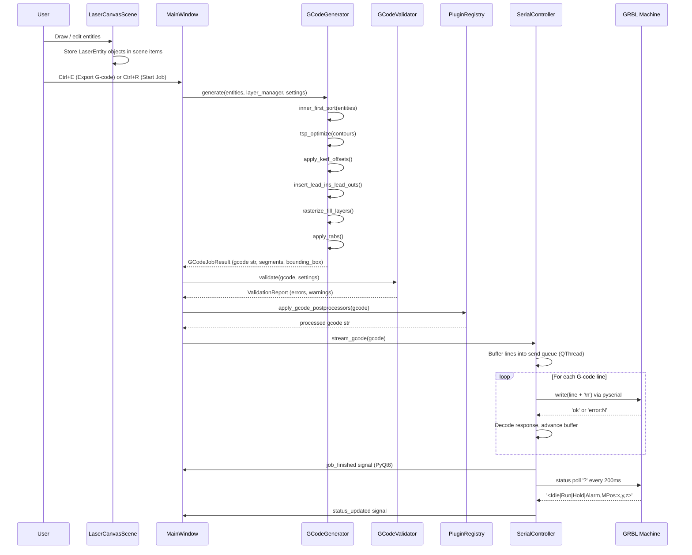

# LaserForge Architecture

> Architecture document for LaserForge v2.5.0. All module names and field names are verified
> against the actual source tree at `/home/k/LaserForge/laserforge/`.

---

## 1. System Overview

```mermaid
flowchart TD
    subgraph UI["UI Layer (PyQt6)"]
        MW["MainWindow\n(main_window.py)"]
        CS["LaserCanvasScene\n(canvas_scene.py)"]
        CP["CutsPanel\n(cuts_panel.py)"]
        LCP["LaserControlPanel\n(laser_control_panel.py)"]
        CON["ConsolePanel\n(console_panel.py)"]
        DLG["Studio Dialogs\n(40+ specialized dialogs)"]
    end

    subgraph CORE["Core Engine (laserforge/core/)"]
        GCG["GCodeGenerator\n(gcode_generator.py)"]
        GCV["GCodeValidator\n(gcode_validator.py)"]
        RST["RasterProcessor\n(raster_processor.py)"]
        OPT["Optimizer\n(optimizer.py)"]
        SC["SerialController\n(serial_controller.py)"]
        PIO["ProjectIO\n(project_io.py)"]
        LM["LayerManager\n(layer_manager.py)"]
        MDL["Data Models\n(models.py)"]
        PLG["PluginRegistry\n(plugin_api.py)"]
    end

    subgraph SPEC["Specialty Engines"]
        KRF["KerfEngine"]
        NST["NestingEngine"]
        BOL["BooleanEngine"]
        BOX["BoxEngine"]
        TAB["TabEngine"]
        ROT["RotaryEngine"]
        HAT["DirectionalHatch"]
        CAM["CameraEngine"]
        GPU["GPUAccelerator"]
        RDA["RuidaEngine"]
        GVL["GalvoEngine"]
        REL["ReliefEngine"]
        LIC["LicenseEngine"]
    end

    subgraph HW["Hardware / External"]
        GRBL["GRBL 1.1+ Controller\n(USB Serial)"]
        DSP["Ruida DSP\n(UDP Ethernet)"]
        WCAM["USB Camera\n(OpenCV)"]
    end

    MW --> CS
    MW --> CP
    MW --> LCP
    MW --> CON
    MW --> DLG
    MW --> PLG

    CS --> MDL
    CP --> LM
    LCP --> SC
    CON --> SC

    GCG --> RST
    GCG --> OPT
    GCG --> KRF
    GCG --> TAB

    MW --> GCG
    MW --> PIO
    SC --> GRBL
    RDA --> DSP
    CAM --> WCAM
    GPU --> RST
```



---

## 2. Module Map

### `laserforge/core/` — CAM Engine & Business Logic

| Module | Size | Purpose |
|---|---|---|
| `models.py` | 8 KB | Core data model dataclasses: `LaserEntity`, `RectEntity`, `CircleEntity`, `LineEntity`, `PathEntity`, `TextEntity`, `ImageEntity`, `LayerCutSettings` |
| `layer_manager.py` | 2 KB | `LayerManager`: owns the ordered list of `LayerCutSettings`; maps `layer_id` integers to settings |
| `gcode_generator.py` | 85 KB | `GCodeGenerator`: full GRBL G-code compiler from canvas entities through all layers and modes |
| `gcode_validator.py` | 44 KB | `GCodeValidator`, `ValidationReport`: pre-flight safety checker for generated G-code programs |
| `raster_processor.py` | 36 KB | Scanline raster fill, Floyd-Steinberg & Atkinson dithering, overscan math, whitespace rapid skipping |
| `serial_controller.py` | 48 KB | `SerialController` (`QThread`): buffered G-code streaming, GRBL status polling, jog, homing, Z-probe |
| `optimizer.py` | 8 KB | `Optimizer`: inner-first contour nesting sort, nearest-neighbor TSP rapid travel minimization |
| `project_io.py` | 12 KB | `ProjectIO`: JSON `.laserproj` save/load serializing all entity types and layer/machine settings |
| `svg_importer.py` | 30 KB | `SVGImporter`: full SVG parser with `<defs>` / `<use>` dereferencing, color-to-layer mapping |
| `svg_exporter.py` | 7 KB | `SVGExporter`: full-canvas SVG export with per-layer `<g>` grouping and mm-precision transforms |
| `dxf_importer.py` | 9 KB | `DXFImporter`: AutoCAD DXF import via `ezdxf` (R12, R2000+) |
| `dxf_exporter.py` | 6 KB | `DXFExporter`: AutoCAD DXF export via `ezdxf` |
| `lbrn_importer.py` | 11 KB | `LightBurnImporter`: `.lbrn2` (JSON) and `.lbrn` (XML) LightBurn project import |
| `lbrn2_exporter.py` | 7 KB | LightBurn `.lbrn2` export for cross-compatibility |
| `geometry_boolean.py` | 9 KB | Low-level Shapely-based CSG geometry helpers |
| `boolean_engine.py` | 8 KB | `BooleanEngine`: Weld/Union, Subtract, Intersect, XOR operations on canvas entities |
| `kerf_engine.py` | 15 KB | `KerfEngine`: auto-directional kerf offsetting, pierce lead-ins/lead-outs, overcut margin |
| `nesting_engine.py` | 15 KB | `NestingEngine`: 2D bin-packing with cavity nesting and 0°/45°/90° rotation evaluation |
| `tab_engine.py` | 8 KB | `TabEngine`: contour slicing to insert holding tabs / bridges with configurable power |
| `rotary_engine.py` | 5 KB | `RotaryEngine`: software G-code Y-axis scaling and GRBL `$101` steps/mm calculation |
| `box_engine.py` | 16 KB | `BoxEngine`: parametric flat-pack box/bin panels with finger joints and dovetail joints |
| `directional_hatch.py` | 32 KB | `DirectionalHatch`: dense vector hatch toolpath generation with angle and cross-hatch |
| `hershey_font.py` | 11 KB | `HersheyFont`: single-line centerline vector stroke font rendering (full ASCII) |
| `image_cutout.py` | 20 KB | `ImageCutout`: alpha boundary extraction and offset contour cutout generation |
| `image_tracer.py` | 23 KB | `ImageTracer`: marching squares vectorization, Otsu threshold, RDP smoothing |
| `camera_engine.py` | 25 KB | `CameraEngine`: OpenCV checkerboard calibration (K, D), fiducial homography (H), bed overlay |
| `fisheye_camera.py` | 5 KB | `FisheyeRectifier`, `FisheyeCalibrationData`: ultra-wide fisheye lens undistortion |
| `gpu_accelerator.py` | 11 KB | `GPUAccelerator`: CUDA/OpenCL hardware acceleration with CPU fallback |
| `materials_database.py` | 12 KB | `MaterialProfile`: pre-calibrated material profiles; custom persistence |
| `art_library.py` | 27 KB | `ArtLibraryManager`, `ArtItem`: `.lflib` component library management |
| `shape_generator.py` | 11 KB | `ShapeGenerator`: parametric stars, gears, polygons |
| `template_generator.py` | 14 KB | `TemplateGenerator`: box joints, living hinges, test cards |
| `barcode_generator.py` | 12 KB | `BarcodeGenerator`: Code128/39, EAN-13, UPC-A, QR code vector/raster output |
| `font_tools.py` | 5 KB | `FontTools`: system font enumeration and text outline path extraction |
| `business_card_generator.py` | 17 KB | `BusinessCardGenerator`: QR contour generation and business card layout |
| `variable_text_engine.py` | 9 KB | `VariableTextEngine`: CSV/TSV batch merge with placeholder substitution |
| `common_line_engine.py` | 10 KB | `CommonLineEngine`: coincident edge detection and deduplication |
| `optimizer.py` | 8 KB | `Optimizer`: inner-first sort and TSP rapid travel minimization |
| `node_editor.py` | 13 KB | `NodeEditor`: vertex-level path editing and trim scissor tool |
| `living_hinge_engine.py` | 9 KB | `LivingHingeEngine`: straight slit, wavy, diamond flex lattice generation |
| `relief_engine.py` | 5 KB | `ReliefEngine`: multi-pass Z step-down and heightmap slicing |
| `galvo_engine.py` | 7 KB | `GalvoEngine`: mirror delay compensation and beam wobble generator |
| `ruida_engine.py` | 8 KB | `RuidaCompiler`, `RuidaUDPClient`: Ruida DSP binary pipeline and Ethernet client |
| `surface_projector.py` | 7 KB | `Surface3DProjector`: non-planar G-code projection onto cylinders/spheres |
| `z_probe_controller.py` | 5 KB | `ZProbeEngine`, `ZProbeSettings`: G38.2 probing cycle and PRB response parser |
| `audio_alerts.py` | 6 KB | `AudioChimeEngine`: WAV tone synthesis and caching for workshop notifications |
| `web_pendant.py` | 11 KB | `WebPendantServer`: embedded HTTP/JSON server for mobile jog pendant |
| `bundle_packager.py` | 12 KB | `BundlePackager`: `.lfpak` ZIP bundle creation, inspection, and selective restore |
| `license_engine.py` | 10 KB | `LicenseEngine`: HMAC-SHA256 license verification, hardware fingerprinting, trial management |
| `auto_connect.py` | 14 KB | `PortDetector`, `AutoConnectWorker`, `USBHotplugWatcher`, `RankedPort` |
| `material_test_generator.py` | 8 KB | `MaterialTestGenerator`: parametric Power × Speed test grid |
| `kerf_test_generator.py` | 7 KB | `KerfTestGenerator`: kerf calibration test pattern generator |
| `sdxl_turbo_engine.py` | 37 KB | `SDXLTurboEngine`: decoupled AI image generation with IPC mailbox |
| `plugin_api.py` | 6 KB | `LaserForgePlugin`, `PluginMetadata`, `PluginRegistry`: stable plugin extension point |
| `worker_lifecycle.py` | 4 KB | Worker thread lifecycle helpers |
| `auto_calibration.py` | 27 KB | `AutoCalibrationEngine`, `FiducialDetector`: automated workbed & camera homography calibration, ArUco/circle detection, gantry skew diagnostics |

### `laserforge/ui/` — Qt6 User Interface

| Module | Size | Purpose |
|---|---|---|
| `main_window.py` | 133 KB | `MainWindow`: application shell, menu/toolbar wiring, dock layout, signal routing |
| `canvas_scene.py` | 74 KB | `LaserCanvasScene`: QGraphicsScene with all drawing tools, snapping, undo/redo, node editor, trim tool, measure tool |
| `canvas_view.py` | 25 KB | `LaserCanvasWidget`: QGraphicsView with mm rulers, zoom/pan, crosshair, grid rendering |
| `cuts_panel.py` | 16 KB | `CutsPanel`: layer table with color swatches, mode dropdowns, speed/power editors |
| `laser_control_panel.py` | 33 KB | `LaserControlPanel`: port selector, jog pad, status telemetry display, macro buttons |
| `console_panel.py` | 5 KB | `ConsolePanel`: color-coded TX/RX/error serial terminal with command prompt |
| `shape_properties.py` | 22 KB | `ShapePropertiesPanel`: numeric X/Y/W/H/rotation/layer editor for selected entities |
| `preview_dialog.py` | 36 KB | `PreviewDialog`: toolpath simulation with scrubber slider and speed multipliers |
| `machine_settings_dialog.py` | 53 KB | `MachineSettingsDialog`: all `MachineSettings` fields across tabbed pages |
| `validation_dialog.py` | 10 KB | `ValidationDialog`: pre-flight G-code validation report viewer |
| `toolbar_builder.py` | 27 KB | `ToolbarBuilder`: CAD, top, and font toolbar construction |
| `menu_builder.py` | 7 KB | `MenuBuilder`: main menu bar construction from `ActionRegistry` |
| `action_registry.py` | 19 KB | `ActionRegistry`: centralized `QAction` factory and keyboard shortcut registry |
| `art_library_panel.py` | 19 KB | `ArtLibraryPanel`: dockable visual component library browser with drag-and-drop |
| `alignment_dialog.py` | 57 KB | `LaserAlignmentDialog`: Print & Cut 2-point registration studio |
| `trace_image_dialog.py` | 60 KB | `TraceImageDialog`: interactive bitmap-to-vector tracing studio |
| `photo_engrave_dialog.py` | 30 KB | `PhotoEngraveDialog`: photo engraving settings with live preview |
| `nesting_dialog.py` | 15 KB | `NestingDialog`: 2D nesting optimizer studio |
| `rotary_dialog.py` | 15 KB | `RotaryDialog`: rotary axis calibration and configuration |
| `directional_hatch_dialog.py` | 24 KB | `DirectionalHatchDialog`: vector hatching studio |
| `image_cutout_dialog.py` | 28 KB | `ImageCutoutDialog`: contour cutout generator studio |
| `box_dialog.py` | 15 KB | `BoxDialog`: parametric box & enclosure studio |
| `living_hinge_dialog.py` | 10 KB | `LivingHingeDialog`: flex lattice hinge studio |
| `z_probe_dialog.py` | 9 KB | `ZProbeStudioDialog`: auto-focus Z-probe cycle studio |
| `surface_wrap_dialog.py` | 8 KB | `SurfaceWrapStudioDialog`: 3D surface toolpath projection studio |
| `job_estimator_dialog.py` | 13 KB | `JobEstimatorDialog`: production cost and time estimator |
| `barcode_designer_dialog.py` | 26 KB | `BarcodeDesignerDialog`: QR & barcode design studio |
| `material_library_dialog.py` | 13 KB | `MaterialLibraryDialog`: material profile browser and editor |
| `material_test_dialog.py` | 7 KB | `TestMatrixDialog`: material burn test grid generator |
| `burn_perimeter_dialog.py` | 40 KB | `BurnPerimeterDialog`: alignment perimeter burning studio |
| `camera_calibration_wizard.py` | 21 KB | Camera calibration 4-step wizard |
| `auto_calibration_dialog.py` | 18 KB | `AutoCalibrationDialog`: 1-click vision auto-calibration, diagnostics telemetry, and target burner |
| `variable_text_dialog.py` | 12 KB | `VariableTextDialog`: CSV batch production merge studio |
| `common_line_dialog.py` | 9 KB | `CommonLineDialog`: coincident edge deduplication studio |
| `tabs_dialog.py` | 12 KB | `TabsDialog`: holding tabs & bridges configuration studio |
| `galvo_dialog.py` | 6 KB | `GalvoDialog`: galvo/fiber laser engine settings |
| `ruida_dialog.py` | 6 KB | `RuidaDialog`: Ruida DSP controller pipeline studio |
| `relief_dialog.py` | 8 KB | `ReliefDialog`: 3D relief engraving and Z-step studio |
| `bundle_packager_dialog.py` | 13 KB | `BundlePackagerDialog`: `.lfpak` packager UI |
| `feedback_dialog.py` | 18 KB | `FeedbackDialog`: in-app beta tester bug and crash report studio |
| `tutorial_dialog.py` | 22 KB | `InteractiveTutorialDialog`, `WelcomeOnboardingDialog`: 6-step guided interactive walkthrough and first-run welcome studio |
| `guide_dialog.py` | 24 KB | `UserGuideDialog`: in-app searchable user manual, CAM parameter guide, and troubleshooting FAQ |
| `theme.py` | 5 KB | Qt stylesheet and dark theme definitions |
| `ui_utils.py` | 1 KB | `create_tool_icon`: programmatic toolbar icon builder |

---

## 3. Data Flow — Canvas → Machine

The complete path from a design element on screen to a command executed by the laser:



**Key classes at each stage:**

| Stage | Class | File |
|---|---|---|
| Entity storage | `LaserEntity` subclasses, `LaserItemWrapper` | `models.py`, `canvas_scene.py` |
| Layer config | `LayerCutSettings`, `LayerManager` | `models.py`, `layer_manager.py` |
| G-code compilation | `GCodeGenerator`, `GCodeJobResult` | `gcode_generator.py` |
| Raster fill | `RasterProcessor` | `raster_processor.py` |
| Toolpath optimization | `Optimizer` | `optimizer.py` |
| G-code validation | `GCodeValidator`, `ValidationReport` | `gcode_validator.py` |
| Plugin post-processing | `PluginRegistry.apply_gcode_postprocessors()` | `plugin_api.py` |
| Serial streaming | `SerialController` | `serial_controller.py` |

---

## 4. Key Data Models

### `LaserEntity` — Base Canvas Object

Defined in [`models.py`](file:///home/k/LaserForge/laserforge/core/models.py).

```python
@dataclass
class LaserEntity:
    id: str              # 8-char UUID fragment (auto-generated)
    layer_id: int        # Index into LayerManager.layers list
    name: str            # Human-readable label ("Shape", "Rect 1", etc.)
    x: float             # Top-left or center X position in mm
    y: float             # Top-left or center Y position in mm
    rotation: float      # Clockwise rotation in degrees
    selected: bool       # Current selection state (not persisted)
    locked: bool         # If True, blocked from canvas interaction
    override_speed: Optional[float]   # mm/min — overrides layer speed if set
    override_power: Optional[float]   # % 0–100 — overrides layer power_max if set
    tabs: List[float]    # Manual tab positions along perimeter (0.0–1.0)
```

**Concrete subtypes:**

| Type | Additional Fields |
|---|---|
| `RectEntity` | `width`, `height`, `corner_radius` |
| `CircleEntity` | `radius_x`, `radius_y` |
| `LineEntity` | `x2`, `y2` |
| `PathEntity` | `contours` (list of contour point lists), `closed`, `anchor_x`, `anchor_y`, `_cached_local_bounds` |
| `TextEntity` | `text`, `font_family`, `font_size`, `bold`, `italic`, `underline`, `fill_mode`, `width`, `height`, `is_mirrored_h`, `is_mirrored_v` |
| `ImageEntity` | `image_path`, `raw_image_path`, `processed_image_path`, `width`, `height`, `dither_mode`, `invert`, `contrast`, `brightness`, `threshold_value`, `dpi`, `gamma`, `sharpen`, `equalize`, `white_clip`, `black_clip`, `halftone_cell_size`, `halftone_angle_deg`, `is_mirrored_h`, `is_mirrored_v` |

### `LayerCutSettings` — Per-Layer CAM Parameters

Defined in [`models.py`](file:///home/k/LaserForge/laserforge/core/models.py).

| Field | Type | Default | Description |
|---|---|---|---|
| `layer_id` | `int` | — | Layer index (0–12) |
| `name` | `str` | `"C00"` | Display name |
| `color` | `str` | `"#000000"` | Hex layer color |
| `mode` | `str` | `"Line"` | `"Line"`, `"Fill"`, `"Fill + Line"`, `"Image"` |
| `speed` | `float` | `1000.0` | Cut feed rate mm/min |
| `power_max` | `float` | `80.0` | Maximum laser power % |
| `power_min` | `float` | `20.0` | Minimum laser power % (M4 dynamic lower bound) |
| `passes` | `int` | `1` | Number of repeated cut passes |
| `z_step` | `float` | `0.0` | Z depth step per pass in mm |
| `line_interval` | `float` | `0.1` | Raster line spacing in mm (~254 DPI) |
| `fill_angle` | `float` | `0.0` | Raster scan angle in degrees |
| `cross_hatch` | `bool` | `False` | Enable 90° second raster pass |
| `air_assist` | `bool` | `False` | Emit `M8`/`M9` air assist commands |
| `output_enabled` | `bool` | `True` | Include layer in G-code output |
| `show_on_canvas` | `bool` | `True` | Show layer entities on canvas |
| `overscan_pct` | `float` | `3.0` | Raster overscan acceleration margin % |
| `is_tool` | `bool` | `False` | Tool/guide layer (no laser output) |
| `pass_delay_sec` | `float` | `0.0` | Pause between multi-pass cuts (diode cooldown) |
| `kerf_offset` | `float` | `0.0` | Total laser beam kerf width in mm |
| `kerf_direction` | `str` | `"Auto"` | `"Auto"`, `"Outward"`, `"Inward"`, `"Off"` |
| `lead_in_type` | `str` | `"None"` | `"None"`, `"Line"`, `"Arc"`, `"Perpendicular"` |
| `lead_in_length` | `float` | `2.0` | Lead-in distance in mm |
| `lead_out_type` | `str` | `"None"` | `"None"`, `"Line"`, `"Arc"`, `"Perpendicular"` |
| `lead_out_length` | `float` | `2.0` | Lead-out distance in mm |
| `overcut_length` | `float` | `0.0` | Overcut past closing vertex in mm |
| `tabs_enabled` | `bool` | `False` | Enable holding tabs on closed contours |
| `tab_count` | `int` | `4` | Number of tabs per closed contour |
| `tab_width` | `float` | `1.0` | Uncut bridge width in mm |
| `tab_power_pct` | `float` | `0.0` | Laser power % across tab (0 = G0 rapid) |
| `corner_power_ramping` | `bool` | `False` | Ramp power around sharp corners |
| `corner_ramp_angle_deg` | `float` | `45.0` | Minimum angle to trigger power reduction |
| `corner_min_power_pct` | `float` | `50.0` | Minimum power % at sharp corners |

### `MachineSettings` — Hardware Configuration

Defined in [`config.py`](file:///home/k/LaserForge/laserforge/config.py). Selected important fields:

| Field | Type | Default | Description |
|---|---|---|---|
| `bed_width` | `float` | `400.0` | Workbed X size in mm |
| `bed_height` | `float` | `400.0` | Workbed Y size in mm |
| `origin_corner` | `str` | `"Bottom-Left"` | Machine home corner |
| `max_s_value` | `int` | `1000` | GRBL `$30` max spindle S value |
| `laser_mode` | `str` | `"M4"` | `"M4"` (dynamic), `"M3"` (constant), `"M106"` |
| `rapid_speed` | `float` | `3000.0` | G0 rapid speed mm/min |
| `baud_rate` | `int` | `115200` | Serial baud rate |
| `x_accel` / `y_accel` | `float` | `500.0` | Machine acceleration mm/sec² for overscan math |
| `overscan_enabled` | `bool` | `False` | Physics-based raster lead-in/lead-out |
| `overscan_mode` | `str` | `"Acceleration"` | `"Acceleration"` (d=v²/2a), `"Percentage"`, `"Fixed"` |
| `white_space_skip_enabled` | `bool` | `True` | G0 rapid across blank raster gaps |
| `kerf_width_mm` | `float` | `0.08` | Default laser spot kerf width |
| `rotary_enabled` | `bool` | `False` | Activate rotary axis mode |
| `rotary_type` | `str` | `"Roller"` | `"Roller"` or `"Chuck"` |
| `custom_macros` | `List[Dict]` | 6 defaults | Quick G-code macro buttons (name, gcode, color) |
| `camera_fisheye_k1`–`k4` | `float` | varies | Fisheye distortion coefficients |

---

## 5. Threading Model

LaserForge runs in a **dual-thread architecture** following the Qt threading rules:

```
┌─────────────────────────────────────────────────────┐
│                  Qt Main (UI) Thread                │
│                                                     │
│  MainWindow  LaserCanvasScene  All QDialog widgets  │
│  GCodeGenerator  ProjectIO  CutsPanel               │
│  (All PyQt6 widget creation and updates here)       │
└───────────────────────────┬─────────────────────────┘
                            │  PyQt6 Signals (thread-safe)
                            │  job_finished, status_updated,
                            │  log_line, error_occurred
                            ▼
┌─────────────────────────────────────────────────────┐
│           SerialController (QThread)                │
│                                                     │
│  • Owns the pyserial Serial object                  │
│  • Blocking read loop in run()                      │
│  • Send queue: thread-safe Python queue.Queue       │
│  • Status poll timer: '?' every 200 ms              │
│  • Never touches Qt widgets directly                │
└─────────────────────────────────────────────────────┘
```

**Rules enforced by the architecture:**
- `SerialController` communicates back to the UI exclusively via `pyqtSignal` emissions —
  never by calling widget methods directly.
- `SerialController.go_to_pos()`, `go_to_zero()`, and all motor move methods check
  `self.is_streaming` and silently drop the command if a job is actively running, preventing
  mid-job position corruption.
- `WebPendantServer` (port 8088) runs in its own daemon thread created internally. All
  callbacks into the `SerialController` are dispatched through the same send queue.
- `GPUAccelerator` raster work (CUDA/OpenCL kernels) executes in a separate Python thread
  within `raster_processor.py`; results are returned synchronously before G-code emission.
- The auto-import watcher (`_init_auto_import_watcher`) polling `~/.laserforge/imported_queue`
  for SDXL Turbo images uses a `QTimer` on the main thread — no additional thread required.

---

## 6. File Formats

### `.laserproj` — Native Project File

**Container:** Plain UTF-8 JSON.

**Structure:**
```json
{
  "version": "2.5.0",
  "machine_settings": { /* MachineSettings fields as dict */ },
  "layers": [ /* List of LayerCutSettings.to_dict() */ ],
  "entities": [
    {
      "type": "RectEntity",
      "id": "a1b2c3d4",
      "layer_id": 0,
      "name": "Outer Frame",
      "x": 10.0, "y": 10.0,
      "width": 80.0, "height": 50.0,
      "corner_radius": 2.0,
      "rotation": 0.0,
      "locked": false
    }
    /* ... */
  ]
}
```

Serialized by `ProjectIO.save_project()` and deserialized by `ProjectIO.load_project()`.
The `type` field drives a dispatcher that instantiates the correct `LaserEntity` subclass.

---

### `.lflib` — Art & Component Library

**Container:** Plain UTF-8 JSON.

Each `.lflib` file is an `ArtLibrary` object. Files are stored in `~/.laserforge/libraries/`.
The `ArtLibraryManager` scans for all `.lflib` files in that directory on startup.

**Structure:**
```json
{
  "name": "Standard Hardware",
  "version": "1.0",
  "items": [
    {
      "id": "uuid-...",
      "name": "M3 Clearance Hole",
      "category": "Fasteners",
      "tags": ["M3", "hole", "screw"],
      "thumbnail_b64": "iVBORw0KGgo...",
      "entities": [ /* list of entity dicts, same format as .laserproj entities */ ]
    }
  ]
}
```

Thumbnails are PNG images base64-encoded inline. Saving a selection to the library
(`Ctrl+Shift+L`) normalizes entity bounding boxes to origin and renders an antialiased
thumbnail at fixed resolution.

---

### `.lfpak` — Portable Project Bundle

**Container:** ZIP archive (Python `zipfile` module) with a `.lfpak` extension.

Created by `BundlePackager.create_bundle()`. Selectively bundles project components chosen
by the user:

```
bundle.lfpak/
├── manifest.json        # Bundle metadata and SHA256 checksums of all assets
├── project.lfg          # Serialized project entities and layer settings
├── materials.json       # Calibrated materials library export
├── machine_settings.json # MachineSettings serialized for the originating machine
└── (optional extras)    # Any parametric template files, custom libraries
```

`manifest.json` contains a SHA256 checksum for each bundled file. `BundlePackager.inspect_bundle()`
reads and verifies the manifest without extracting any files, enabling safe preview before
import. `restore_bundle()` supports selective import (artwork only, materials only, machine
profile only) with `merge` or `overwrite` conflict resolution strategies.

---

## 7. Plugin Extension Point

The plugin system (`plugin_api.py`) is intentionally minimal and stable:

- Plugins are discovered from `~/.laserforge/plugins/<name>/plugin.py` at startup.
- `PluginRegistry.discover_and_load(app_context)` is the sole entry point.
- The `app_context` dict is constructed in `MainWindow.__init__` and provides references
  to core subsystems (`settings`, `layer_manager`, `serial_ctrl`, `scene`).
- Three hook types are supported: G-code post-processors, import format handlers,
  and export format handlers.
- All registered G-code post-processors run in sequence (registration order) via
  `PluginRegistry.apply_gcode_postprocessors(gcode)` between `GCodeGenerator` output
  and `SerialController` streaming.

See [`docs/plugin_guide.md`](file:///home/k/LaserForge/docs/plugin_guide.md) for the full
developer guide.
